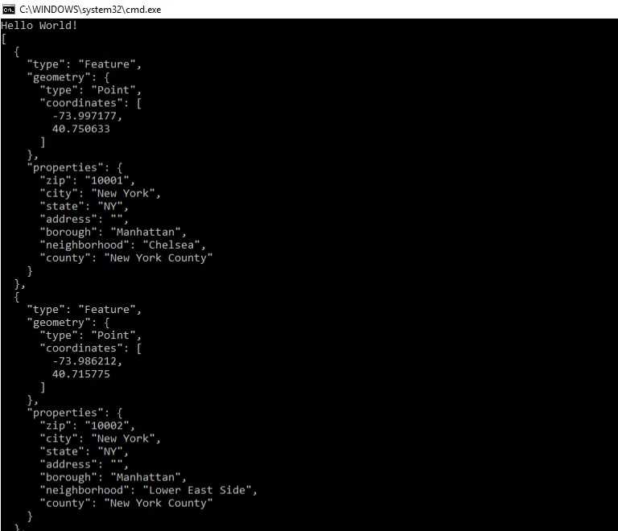

# Lab08-LINQ-in-Manhatten

## About this project
This project takes and parses a JSON file. The goal is to be able to find an available property through LINQ queries and lambda expressions. The methods return the results as strings.

## Example

## How to use
This program requires Visual Studio. Once the repo has been cloned to the user's local machine, they simply need to navigate to the solution folder, and open the solution using Visual Studio. Then, run the program.cs file. After that, follow the prompts. The test file can be opened via the test solution also located in the project directory.

## Licensing
This program is available under the MIT license.

## Acknowledgements
[jcqnly](https://github.com/jcqnly)
[steph](https://github.com/IndigoShock)